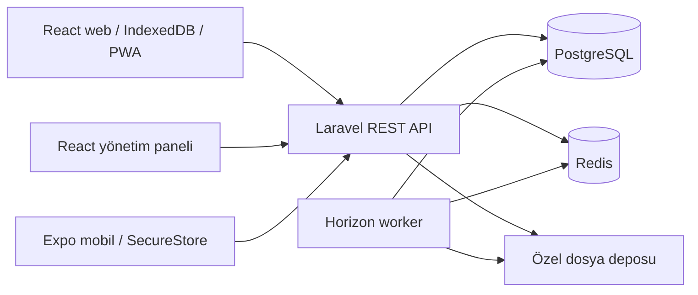

# Sistem mimarisi

Durum: Laravel Identity/Tenancy/QuestionBank/Study/Exams modülleri, PostgreSQL/Redis, Horizon ve şifreli bildirim kuyruğu uygulanmıştır. QuestionBank merkezi katalog, taslak/sürüm/yayın ve yayımlanmış soru okuma API'sini içerir; ayrıntıları [QUESTION_BANK](QUESTION_BANK.md) belgesindedir. React yönetim paneli cookie/CSRF ile bu API'ye bağlanır; OpenAPI'den üretilen ortak tipler ve React bağımsız HTTP istemcisi workspace paketlerindedir. Öğrenci web Study API ile tek soru alıştırması ve kalıcı geçmişi sunar; süreli deneme ve Expo mobil gerçek API istemcisi de eklendi; import ve offline tasarım aşamasındadır. [Study kapsamı](STUDY.md) ayrı belgelenmiştir. Çevrimdışı öneriler güncel yönergeye göre ayrıca kapsamlandırılacaktır. Kurulum [DEVELOPMENT](DEVELOPMENT.md), sürümler [TECH_STACK](TECH_STACK.md) içindedir.

## Topoloji

Laravel modüler monolit başlangıç karmaşıklığını sınırlar; PostgreSQL tek merkezi doğruluk kaynağıdır. Redis geçici cache ve queue içindir; sınav sonuçlarının veya idempotency kayıtlarının tek kalıcı deposu olamaz. Mobil SQLite ve web IndexedDB kullanıcıya/bağlama göre ayrılmış yerel kopyalar ve outbox taşır.

## Modül sınırları

| Modül | Sorumluluk |
| --- | --- |
| Identity | Hesap, oturum, e-posta doğrulama, parola sıfırlama ve silme |
| Tenancy | Şirket, davet, üyelik, bağlam ve erişim denetimi |
| QuestionBank | Ders, konu, sürümlü soru/seçenek/görsel ve kaynak |
| Exams | Sınav, şablon sürümü, deneme, cevap ve değerlendirme |
| Study | Favori, yanlışlar, çalışma geçmişi ve ilerleme projeksiyonları |
| Offline | Paket yayını, içerik değişiklikleri, senkronizasyon ve tekrar güvenliği |
| Imports | Kaynak analizi, staging, doğrulama, onay ve aktarım |
| Advertising | İleride reklamveren/kampanya/alan; çekirdek sınav akışından ayrı |

Başlangıç yerleşimi `backend/app/Modules/<Module>/` altında Actions, Models, Policies ve Http alt dizinleriyle ihtiyaç kadar kurulur. Controller giriş/çıkışı yönetir; FormRequest doğrular; Policy yetkilendirir; Action iş kuralı ve transaction'ı yürütür; Resource yanıtı şekillendirir. Her model için soyut repository eklenmez. DI dış servisler, saat ve platform depolama adaptörleri gibi gerçek değişim sınırlarında kullanılır.

Web, mobil ve admin aynı `/api/v1` sözleşmesini tüketir. Ortak paketlerde DOM, React Native ve native depolama importları bulunmaz; cookie ve Bearer token davranışı istemci adaptörlerinde ayrılır. API sözleşmesi gelecekte OpenAPI'den istemci/tip üretimini besler.

## Mimari kararlar

| Karar | Gerekçe / sonuç |
| --- | --- |
| Ortak veritabanı ve doğrulanan çalışma bağlamı | Çoklu üyeliği destekler; kişisel verinin yanlış şirkete bağlanmasını önler |
| Değişmez soru ve kural sürümleri | Geçmiş denemeler yeniden üretilebilir; güncel içerik sonuçları değiştirmez |
| Yerel outbox + sunucuda transaction/idempotency | Ağ kesintisinde kayıt kaybolmaz; tekrar sonuç çoğaltmaz |
| Sunucu nihai değerlendirme otoritesi | İstemciden gelen puan, kullanıcı kimliği ve cevap anahtarı güvenilir kabul edilmez |
| Offline sınav çalışma niteliğinde | Cihaz saati ve yerel cevap anahtarı güvenilir gözetimli sınav güvenliği sağlayamaz |
| npm workspaces, ayrı Composer | İstenen monorepo için yeterli; ek build orchestration aracı şu an gerekmez |
| Merkezi marka yapılandırması | Geçici ad ve görsel kimlik uygulamalara dağılmaz |

## İstemci deneyimi

Marka başlığı/logo/renkler yapılandırmadan; boşluk, tipografi, kontrast ve bileşen durumları ortak tasarım kararlarından yönetilir. Webde masaüstü navigasyonu, mobilde doğal navigasyon ve tabletlerde geniş alana uygun düzen oluşturulur. HTML/CSS ile native bileşenler zorla tekleştirilmez.

Soru çözme yerel deneme durumuyla yürür; online otomatik kayıt kontrollü sıklıkta yapılır. Outbox her cevap değişikliğini önce kalıcılaştırır. TanStack Query ağ verisini yönetir; çevrimdışı kalıcılık için tek başına query cache kullanılmaz. Deneme zamanlayıcısı arka planda kesilebilen bir interval'e değil başlangıç/son tarih ve elapsed ölçümüne dayanır; offline süre doğruluğunun sınırı sonuçta saklanır.

## Operasyon ve performans

PostgreSQL sorguları sayfalı, gerekli ilişkiler eager-loaded ve indeksli olur. Paketler sıkıştırılır; sürüm farkları parça bazında indirilir. Import, görsel işleme, e-posta, paket üretimi ve büyük rapor işleri kuyruğa alınır. İşler yalnızca doğrulanmış kaynak kimliklerini taşır; yürütülürken yetki/üyelik yeniden kontrol edilir.

Başlangıç dağıtım hedefi: HTTPS reverse proxy, PHP 8.4 API, ayrı Horizon worker, scheduler, PostgreSQL, Redis ve özel dosya deposu. Web/admin statik dağıtımı API ile aynı site alanı altında yapılandırılır. Sağlayıcı ve ülke seçilmedi; kişisel veri/aktarımı değerlendirmesi öncesinde üçüncü taraf servise veri gönderilmez.

Dağıtım aşamasında health/readiness, migrations, queue drain, cache yenileme, geriye uyumlu API, şifreli yedek ve geri yükleme tatbikatı hazırlanır. Üretim anahtarları secret store'da tutulur. İzleme kullanıcı/token verisini maskeleyecek; RPO/RTO ve saklama süreleri operasyon kararları olarak belirlenir. Yerel API ve worker çalışmaktadır; üretim deploy yapılmadı. Kurumlara özel gelecekteki soru/sınav içeriği ayrı tenant sahipliğiyle tasarlanacak; merkezi soru yayın yetkisi kurum yöneticisine verilmez.

## Uygulanan süreli deneme ve mobil

[EXAMS](EXAMS.md) gerçek `exam_attempts`/`exam_answers` şemasını, yetki, sabit sürüm, revision, sunucu süresi ve değişmez sonucu anlatır. Önceki genel `attempts`/şablon/rapor tabloları gelecekteki tasarımdır. Expo istemcisinin native paket/test sınırları [MOBILE](MOBILE.md) içinde ayrıca raporlanır.
