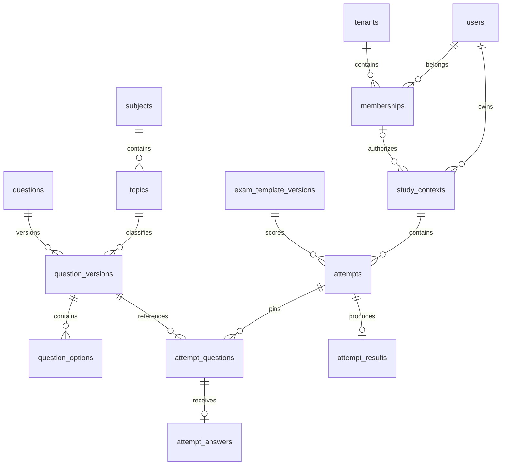

# Veritabanı tasarımı

Durum: `users`, `password_reset_tokens`, `sessions`, `personal_access_tokens`, `tenants`, `memberships`, `study_contexts`, `audit_events`; merkezi `subjects`, `topics`, `exam_types`, `question_sources`, `questions`, `question_versions`, `question_options`, `practice_attempts`, `exam_attempts`, `exam_answers` migration ile oluşturuldu. Laravel cache/jobs/batch/failed-job altyapı tabloları da vardır. İçerik görselleri, geçmiş sınavlar, resmî sınav şablonu/import/yönetişim/offline tabloları aşağıda **öneri** olarak anlatılır; henüz uygulanmadı. Alanlar İngilizce, zamanlar UTC `timestamptz`; API ISO 8601 döndürür. UUID kimlikler kullanılır. Yayımlanmış içerik fiziksel olarak güncellenmez; yeni sürüm eklenir.

Tek soru alıştırmasında sabit sürüm, selected option, sunucu sonucu ve bağlam `practice_attempts` içinde saklanır; composite FK/CHECK/trigger tamamlanmış sonucu korur. Ayrıntılar [STUDY](STUDY.md) içindedir.

## İlişkiler

## Kimlik ve üyelik

| Tablo | Temel alanlar ve kurallar |
| --- | --- |
| `users` | `id`, normalize `email` unique, `password`, `name`, `email_verified_at`, `platform_role`, `status` |
| `tenants` | `id`, `name`, `slug` unique, `status`, `branding` |
| `memberships` | `id`, `tenant_id`, `user_id`, `role`, `status`, `joined_at`, `revoked_at`; unique `(tenant_id,user_id)` ve `(id,tenant_id,user_id)` |
| `invitations` | `id`, `tenant_id`, `email`, hashlenmiş `token`, `role`, `expires_at`, `accepted_at`, `invited_by` |
| `study_contexts` | `id`, `user_id`, nullable `tenant_id`, nullable `membership_id`; kişisel veya şirket bağlamı |
| Oturum tabloları | Laravel oturum, parola sıfırlama ve Sanctum token tabloları; UUID kullanıcıya uyarlanacak |

`study_contexts` CHECK kuralı: kişisel bağlamda `tenant_id` ve `membership_id` birlikte NULL; şirket bağlamında ikisi birlikte dolu. Şirket bağlamındaki `(membership_id,tenant_id,user_id)` üçlüsü `memberships` üzerinde composite FK taşır. Böylece farklı kullanıcının veya şirketin üyeliği bağlama atanamaz. Aktiflik FK ile garanti edilemez; transaction içinde üyelik yetkisi ayrıca kontrol edilir.

Kişisel bağlam için partial unique `(user_id) WHERE tenant_id IS NULL`; şirket bağlamı için `(user_id,tenant_id) WHERE tenant_id IS NOT NULL` kullanılır. NULL içeren sıradan unique index'in kişisel kayıt tekrarını önlediği varsayılmaz. Üyelik iptali kaydı silmez; geçmiş kayıtların bağlamı değişmez.

## Merkezi içerik

Uygulanan sürümün tam kapsamı [QUESTION_BANK](QUESTION_BANK.md) içindedir. `questions` tablosu `revision`, `latest_version_id`, `published_version_id` ve `created_by` taşır; pointer/soru bağları composite FK'dır. `question_versions` metin/açıklama, ders/konu/tür/kaynak, cevap seçeneği ve nullable `published_at` taşır. Her API düzenlemesi yeni sürüm oluşturur. Yayımlanmış sürüm ve seçenekleri PostgreSQL trigger'ları UPDATE/DELETE/sonradan seçenek INSERT işleminden korur. Public pointer yalnız yayımlanmış sürüme atanabilir. `audit_events.tenant_id` merkezi işlemler için NULL olabilir; kurum işlemleri gerçek tenant kimliğiyle kaydedilir.

Aşağıdaki tablo mevcut çekirdeği ve sonraki genişlemeleri birlikte gösterir. Kaynak hak inceleme durumu, dosya/görsel, içerik hash'i, sınav şablonu ve geçmiş sınav alanları henüz uygulanmadı; ilk kaynak modeli `title`, nullable `url` ve `citation` içerir. `exam_types` esnek `name`/unique `code` kataloğudur. Katalog API'si oluşturma/listeleme sunar; etiket güncelleme/silme yoktur.

| Tablo | Temel alanlar ve kurallar |
| --- | --- |
| `subjects` / `topics` | Ders/konu; `topics.subject_id` FK, `(id,subject_id)` unique |
| `question_sources` | Kaynak URL/dosya referansı, sınav yılı/dönemi, hak inceleme durumu ve belge özeti |
| `questions` | Kalıcı soru kimliği, yayın durumu, güncel yayın sürümü referansı |
| `question_versions` | `question_id`, `version`, `subject_id`, `topic_id`, metin/açıklama, kaynak, doğru seçenek referansı, içerik hash'i; unique `(question_id,version)` |
| `question_options` | `id`, `question_version_id`, `position`, `text`; unique `(question_version_id,position)` ve `(id,question_version_id)` |
| `question_assets` | `question_version_id`, private storage key, MIME, boyut, SHA-256 ve erişilebilir açıklama |
| `exam_templates` / `exam_template_versions` | Şablon kimliği, sürüm, tür, süre, soru/konu dağılımı, puanlama, geçme koşulu, `evaluator_version`, resmî kaynak/doğrulama durumu |
| `exams` / `exam_versions` / `exam_questions` | Geçmiş sınav kimliği/yılı/dönemi/türü/kaynağı; değişmez sınav tanım sürümü ve o sürümün soru listesi |

Merkezi içerik tabloları tenant bağımsızdır. Güncel yönergedeki gelecekteki kurum içerikleri ayrı sahiplik/yayın kapsamı gerektirir; bu sürümde merkezi tablolara tenant sahipliği eklenmedi ve merkezi havuza otomatik katılmaz. `(topic_id,subject_id)` composite FK ders/konu uyuşmazlığını engeller. Konu `parent_id` aynı derse composite FK ile bağlanır. Seçenek sayısı dört veya beşe sabitlenmez; API limiti 10'dur. Yayımlama en az iki seçenek, bir doğru seçenek, kaynak kaydı ve gerekli alanları doğrular; kaynak hak incelemesi ayrıca üretim kapısıdır.

Doğru seçenek `(correct_option_id,id)` üzerinden `question_options(id,question_version_id)` hedefine composite FK taşır; seçenek başka soru sürümünden olamaz. Taslakta doğru seçenek NULL olabilir; yayınlanmış sürümde NULL olmasını CHECK engeller. Döngüsel FK nedeniyle taslak sürüm oluşturma, seçenek ekleme ve yayınlama tek transaction içinde yapılır. Yayınlanmış sürümün metni, açıklaması, ders/konusu ve cevap anahtarı sabittir.

Bir soru birçok geçmiş sınavda kullanılabilir. `exam_versions` unique `(exam_id,version)`; `exam_questions` unique `(exam_version_id,position)` ve `(exam_version_id,question_version_id)` taşır. Kullanılmış sınav sırası/sürüm eşlemesi değiştirilecekse yeni tanım sürümü oluşturulur; geçmiş denemeler kendi `attempt_questions` listesini korur.

## Denemeler ve çalışma

| Tablo | Temel alanlar ve kurallar |
| --- | --- |
| `attempts` | UUID `id`, `context_id`, `mode`, optional `exam_version_id`, `template_version_id`, `status`, başlangıç/bitiş, `version`, `offline`, `verification_status`; unique `(id,context_id)` |
| `attempt_questions` | `id`, `attempt_id`, `question_version_id`, `position`; unique `(attempt_id,position)` ve `(id,attempt_id,question_version_id)` |
| `attempt_answers` | `attempt_id`, `attempt_question_id`, `question_version_id`, nullable `selected_option_id`, `version`; her deneme sorusuna bir cevap |
| `attempt_results` | unique `attempt_id`, doğru/yanlış/boş, puan/oran, elapsed, `evaluator_version`, kural hash'i ve ders bazlı sonuç snapshot'ı |
| `favorites` | `context_id`, `question_id`, `version`, `deleted_at`; unique `(context_id,question_id)` |
| `study_progress` | `context_id`, `subject_id`, sayımlar; unique `(context_id,subject_id)`; cevap/sonuçlardan yeniden üretilebilir projeksiyon |

`attempt_answers(attempt_question_id,attempt_id,question_version_id)` composite FK denemenin soru listesine; `(selected_option_id,question_version_id)` composite FK o sürümün seçeneklerine bağlanır. Boş cevap NULL'dır. Deneme sorusunun sürümü veya seçeneği karıştırılamaz. Şablon sürümü ve değerlendirme kodu sürümü korunur; kullanılan eski evaluator handler'ı yeni deploy'da silinmez. Tamamlanmış cevap/sonuçlar kullanıcı tarafından değiştirilemez.

Yanlışlar, kullanıcının yetkili bağlamındaki değerlendirilmiş cevaplardan üretilir; yeni çözüm eski deneme sonucunu değiştirmez. Bir yanlışın tekrar listeden çıkarılması davranışı Study modülünde son cevaba göre tanımlanır, geçmiş kaydı silmez. Favoriler soru kimliğine bağlıdır; eski deneme görüntülemesi ise soru sürümüne bağlıdır.

## Çevrimdışı, aktarım ve yönetişim

| Tablolar | Amaç |
| --- | --- |
| `question_packages`, `package_versions`, `package_items` | Değişmez manifest ve soru sürümü listesi; hash, sürüm ve delta |
| `sync_operations` | Kullanıcı, cihaz, bağlam, `operation_id`, payload hash, sonuç; unique `(user_id,operation_id)` |
| `change_events` | Commit sıralı cursor, kullanıcı/bağlam/varlık/sürüm, tombstone; yetkili artımlı indirme |
| `import_batches`, `import_rows` | Özel kaynak dosyası, inceleme/eşleme, satır durumu/hataları, onaylayan ve aktarım anahtarı |
| `legal_documents`, `user_acknowledgements`, `user_consents` | Metin sürümleri, aydınlatma kaydı, ayrı amaç bazlı rıza/geri çekme |
| `account_deletion_requests`, `audit_events` | Silme iş akışı ve hassas veri içermeyen işlem izi |

Değişiklik cursor'u sıradan transaction dışı sequence olarak uygulanmaz: önce sequence alan transaction geç commit ederse istemci bu kaydı atlayabilir. İlk sürümde transaction içinde kilitlenen bir cursor sayacı, domain yazımıyla birlikte commit sırasını korur; ölçek ölçümünde alternatif değerlendirilir. İşlem başına domain yazımı, idempotency sonucu, değişiklik olayı ve ilerleme güncellemesi aynı transaction içindedir.

Reklam için ertelenmiş model: `advertisers`, `campaigns` (başlangıç/bitiş, durum, optional tenant), `ad_slots`, `creatives`, `ad_metrics` (anonim toplu gösterim/tıklama). Öğrenci davranışıyla hedefleme veya reklam SDK'sı bu tasarımla otomatik olarak yetkilendirilmez.

## İndeksler, silme ve migration

- Üyelik `(user_id,status)`, `(tenant_id,status,role)`; deneme `(context_id,created_at,id)` ve `(context_id,status)`.
- Soru sürümü `(subject_id,topic_id)`; yayın listelemesi için sorguya uygun durum/kimlik indeksi; tüm FK referans kolonlarına ihtiyaçlarına göre indeks.
- Cevap ve paket ilişkilerinde parent/sıra; sync için kullanıcı/işlem unique ve `(user_id,context_id,cursor)` değişiklik indeksi.
- Soru metni hash'i mükerrer aday bulur; farklı kaynak ve görsel varyasyonlar yalnız hash ile kesin mükerrer sayılmaz.
- Yayınlanmış ve denemede kullanılan sürüm FK'ları `RESTRICT`; kullanıcı hesabı silme kontrollü purge/anonymize işidir. Soft delete tek başına KVKK veri imhası değildir.
- Migration sırası kimlik/tenant → bağlam → içerik/sürüm → şablon/sınav → deneme/cevap/sonuç → çalışma → offline/import/yönetişim olur.

Identity/Tenancy/QuestionBank FK/CHECK/unique, transaction ve yayımlanmış içerik trigger davranışları PostgreSQL integration testlerinde doğrulandı; henüz uygulanmamış modüller için aynı kontroller gerekecek. SQLite testleri merkezi veritabanı davranışının yerine kullanılamaz. Mevcut listeler sayfalıdır; gelecekteki raporlar sadece doğrulanmış bağlamdan filtrelenecek.

## Uygulanan süreli deneme ve mobil

[EXAMS](EXAMS.md) gerçek `exam_attempts`/`exam_answers` şemasını, yetki, sabit sürüm, revision, sunucu süresi ve değişmez sonucu anlatır. Önceki genel `attempts`/şablon/rapor tabloları gelecekteki tasarımdır. Expo istemcisinin native paket/test sınırları [MOBILE](MOBILE.md) içinde ayrıca raporlanır.
